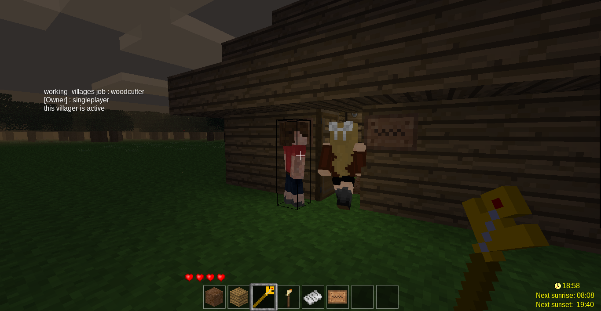
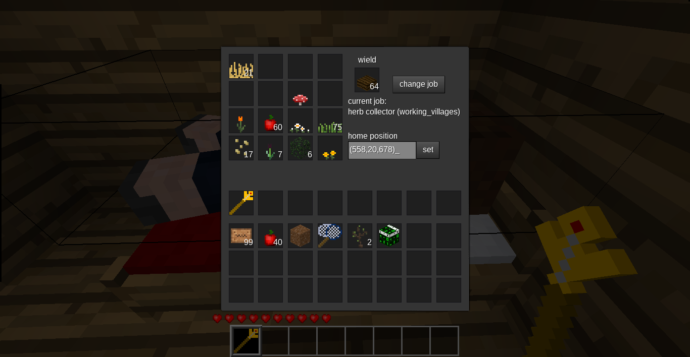
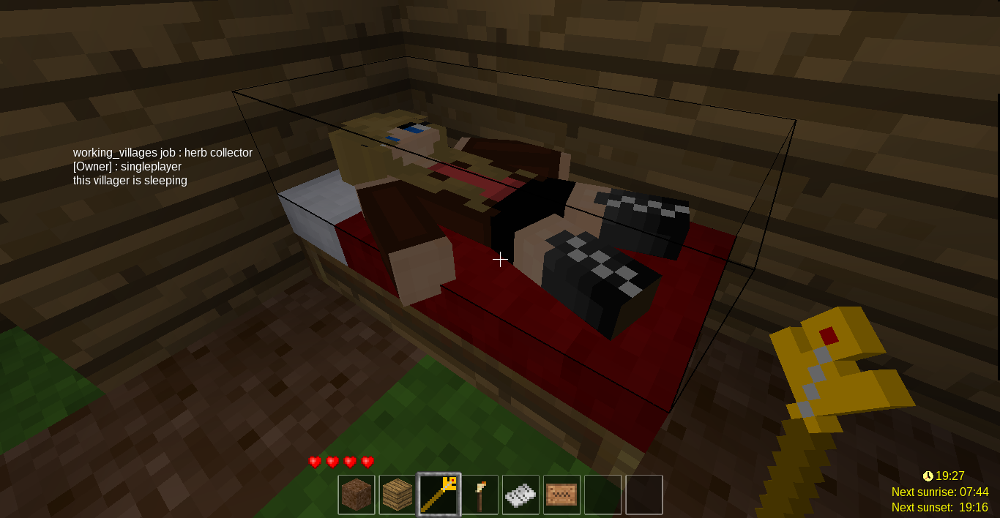
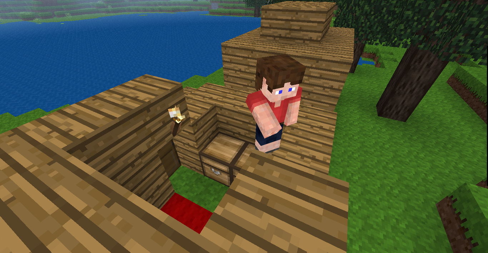

# Working Villages — Improved Edition

[](LICENSE)


A Minetest / Luanti modpack that adds intelligent villager NPCs who perform jobs, manage livestock, farm crops, fish, and build up villages — all configurable through an in-game **Wizard Stick** GUI with no manual commands required.

This is a heavily improved fork of [theFox6/working_villages](https://github.com/theFox6/working_villages).

---

## Screenshots






---

## What's New in This Fork

### 🔧 Bug Fixes
- **Fence/wall pathfinding** — Villagers no longer clip through or get stuck in fence corners. The pathfinder now treats fence-like nodes (`fence`, `wall`, `bars`, `gate`, `railing` groups) as solid barriers and checks intermediate diagonal cells too.
- **Stuck-in-corner recovery** — If a villager gets stuck on the same waypoint for too long, it applies a random nudge to physically escape, then re-paths.
- **Farmer item filter** — Farmer no longer picks up grass, sticks, or other random ground drops. Only actual farming produce and seeds (items with `farming:` prefix matching known plant definitions) are collected.
- **Chickener crash fix** — `kill_chicken` no longer calls `on_punch` with the villager entity (which crashes mods like `creatura`/`animalia` that expect a real player ObjectRef). Drops are added directly.
- **Chickener breed crash fix** — `try_breed` no longer calls `on_rightclick` with the villager entity. Uses `pcall`-wrapped feed API instead, then spawns a chick directly.
- **Dual job naming** — Job names use only valid characters (`working_villages:dual_farmer_chickener` style) to comply with Minetest naming conventions.
- **Dual job load timing** — Jobs are now registered synchronously at load time, not deferred with `minetest.after`, fixing "Tried to register item after load time" errors.

### 🪄 Wizard Stick
A new craftable tool replacing the need for manual form navigation. Right-click any villager you own to open a full GUI wizard:

| Button | Function |
|---|---|
| 📋 Assign Job | Choose any single job from a scrollable list |
| ⚔ Dual Job | Assign two combined jobs to one villager |
| 🗺 Work Area | Set a circle or square work zone by clicking the ground |
| ✖ Clear Area | Remove work area restriction |
| ⏰ Work Hours | Set start/end hour — villager auto-pauses outside this window |
| 🛏 Assign Bed | Click a bed block to assign it as this villager's bed |
| 🏠 Assign Home | Click any ground position to set as home |
| 📦 Assign Chest | Auto-finds nearest chest within 20 blocks |
| ✏ Rename | Set a custom nametag |
| 💨 Speed | Set walk/wander speed (0.5–6) |
| ✈ Teleport Here | Pulls the villager to your position instantly |
| ⏸ Pause / ▶ Resume | Toggle work state |
| 💬 Bubble: ON/OFF | Show mood icon + current action above villager's head |
| 🐔 Chicken Config | Set min/max chicken counts for the Chickener job |
| 🎒 Inventory | View what the villager is currently carrying |
| 🔄 Reset Job Data | Clear stuck job state while preserving area and settings |

**Craft recipe:**
```
[Mese Crystal] [  ] [  ]
[  ] [Stick] [  ]
[  ] [  ] [Stick]
```

### 😊 Mood System
Villager mood (0–100) updates every 30 seconds:
- **Increases** when the villager has a bed, a home, or is actively working
- **Decreases** when paused or stuck
- Displayed as emoji (😊 Happy / 😐 Content / 😟 Unhappy / 😢 Miserable) in the Wizard GUI and optionally as a chat bubble above the villager's head

### ⏰ Work Hours
Set per-villager work start/end hours (0–24 game time). The villager auto-pauses outside its shift and resumes when the time comes back around.

### ⚔ Dual Skill System
Combine any two jobs into one villager. The villager alternates between both job behaviours each cycle. All valid combinations are pre-registered at load time. Assign via the Wizard Stick's Dual Job menu.

Examples: `farmer + chickener`, `farmer + plant_collector`, `fisher + torcher`, etc.

---

## Jobs

### Original Jobs (from upstream)
| Job | Description |
|---|---|
| **Farmer** | Harvests mature crops and replants seeds. Supports all `farming` mod plants. Only collects actual farming produce — ignores grass and random drops. |
| **Plant Collector** | Collects plants and fauna for dyes and other uses. |
| **Builder** | Builds structures defined by building markers. |
| **Guard** | Patrols and protects an area. |
| **Follow Player** | Follows any nearby player (night-active). |
| **Torcher** | Follows player and places torches in dark areas (night-active). |
| **Snow Clearer** | Clears snow nodes from the ground. |

### New Jobs (this fork)

#### 🐔 Chickener
A fully autonomous chicken farmer. Give them a chest and optionally some seeds:
- Roams work area collecting **eggs** dropped on the ground
- **Hatches eggs** when chicken population falls below minimum
- **Randomly feeds** nearby chickens wheat seeds (walks up, tosses seeds, consumes one from inventory)
- **Breeds chickens** using seeds taken from the assigned chest when population is moderate
- **Culls excess chickens** when count exceeds maximum — removes entity directly and adds raw chicken to inventory
- Collects **raw chicken** dropped on the ground
- Deposits **raw chicken** to the assigned chest when carrying 8+
- Configurable **min/max chicken counts** via Wizard Stick

Compatible with: `animalia`, `mobs_redo`, `mob_core`, and similar mods.

#### 🎣 Fisher
- Searches for a water edge within the work area
- Walks to the fishing spot and faces the water
- Casts (plays mining animation) and has a **40% catch chance** per attempt
- Deposits fish to the assigned chest when carrying 8+
- Moves to a new fishing spot periodically

Compatible with: `fishing`, `animalia`, `mobs_redo`, and similar mods.

---

## Work Area System

Set a villager's work area via the Wizard Stick → 🗺 Work Area:
1. Choose **Circle** or **Square**
2. Set the **radius** in blocks (4–64)
3. Click **OK — then click ground** to set the center point

The pathfinder respects this boundary — villagers will not path outside the zone. Guards and farmers stay within their assigned territory.

---

## Installation

### Option A — Download ZIP
1. Download this repository as a ZIP
2. Extract to your Minetest/Luanti `mods` folder
3. The folder should be named `working_villages_improved` (or rename to `working_villages` if replacing the original)
4. Enable in your world's mod settings

### Option B — Git clone
```bash
cd ~/.minetest/mods
git clone --recursive https://github.com/YOUR_USERNAME/working_villages_improved.git
```

### Dependencies
| Mod | Required? | Notes |
|---|---|---|
| `default` | **Required** | Minetest Game default mod |
| `modutil` | Optional | Bundled as portable submodule |
| `doors` | Optional | Villagers can interact with doors |
| `beds` | Optional | Villagers use beds at night |
| `areas` | Optional | Respects area protection |
| `farming` | Optional | Required for Farmer job to be useful |
| `animalia` | Optional | Chickener and Fisher work best with this |
| `mobs_redo` | Optional | Alternative mob mod for Chickener/Fisher |

---

## Compatibility

Tested on:
- **Luanti 5.14.0**
- `animalia` (chicken breeding, egg collection, fishing)
- `creatura` (base mob framework — villager no longer crashes it)
- `farming` (full crop list supported in Farmer)
- `technic_plus` / `uraniumstuff` (no conflicts)
- `regional_weather` (no conflicts)

---

## Crafting Recipes

### Wizard Stick
```
[mese_crystal] [  ] [  ]
[  ] [stick]   [  ]
[  ] [  ]  [stick]
```
Output: `working_villages:wizard_stick`

> The original Commanding Sceptre is still available and works as before (pause/resume on left-click, open inventory on right-click).

---

## API

See [`working_villagers/api.MD`](working_villagers/api.MD) for the full villager and job registration API.

### Registering a custom job
```lua
working_villages.register_job("mymod:job_myjob", {
    description      = "myjob (mymod)",
    long_description = "I do my custom job.",
    inventory_image  = "mymod_job_icon.png",
    jobfunc = function(self)
        self:handle_night()
        self:handle_chest(take_func, put_func)
        self:handle_job_pos()
        self:count_timer("myjob:search")
        self:handle_obstacles()
        if self:timer_exceeded("myjob:search", 20) then
            -- your job logic here
        end
    end,
})
```

### Creating a dual job programmatically
```lua
-- Combine any two registered jobs:
local combo = working_villages.create_dual_job(
    "working_villages:job_farmer",
    "mymod:job_myjob"
)
-- combo = "working_villages:dual_farmer_myjob"
```

### Work area in job code
```lua
-- Access the villager's configured work area:
local area = self.job_data and self.job_data.work_area
-- area = { center={x,y,z}, shape="circle"|"square", radius=16 }

-- Check if a position is inside:
if pathfinder.pos_in_area(some_pos, area) then
    -- do something
end
```

---

## Configuration (minetest.conf)

```
# Allow villagers to work in areas protected by their owner
working_villages_owner_protection = false

# Enable automatic villager spawning
working_villages_enable_spawn = false

# Enable debug tools
working_villages_enable_debug_tools = false
```

---

## License

- **working_villages_improved** improvements: MIT License
- **Original working_villages** by theFox6: MIT License
- Villager skin textures from Homedecor mod: CC-BY-SA 3.0 or higher
- API base from Maidroid mod: LGPLv2.1 or later
- Egg textures from Maidroid mod: CC-BY-SA 4.0 or later
- Letters texture from Memorandum mod
- Sign textures and torcher job texture base from `default` mod / Gambit: CC BY-SA 3.0
- Horsetail texture base for herb collector from Mossmanikin's Ferns: CC-BY-SA 3.0

---

## Credits

- **Original mod**: [theFox6](https://github.com/theFox6/working_villages)
- **This fork**: Improved pathfinding, Wizard Stick, Chickener job, Fisher job, Dual Skill system, Mood system, Work Hours system

## Contributing

Bug reports and pull requests welcome! Please check existing issues before opening a new one.

When reporting a bug, include:
- Luanti/Minetest version
- List of other active mods
- The full error message from the log
